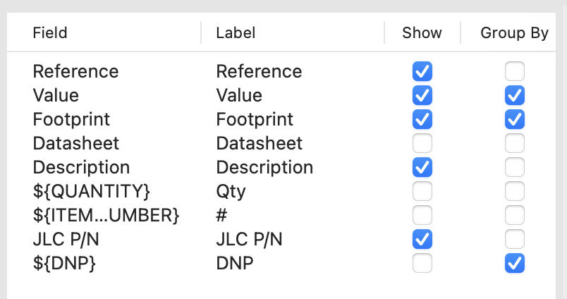

# 16299 Balancing Robot PCB

Updated version of the PCB for 16299.

A submodule is used for some parts, so be sure to clone recursively:
```bash
git clone --recursive https://github.com/SuperTails/16299-balancing-robot.git
```

## BOM/Assembly Export

To generate the BoM:

1. Open the schematic editor
2. Ensure the settings are as shown below
3. Hit "export".



To generate the gerber and drill files, follow
[JLC's guide](https://jlcpcb.com/help/article/how-to-generate-gerber-and-drill-files-in-kicad-7).
**Make sure you set your output folder to `fab/`.**

To generate the placement files:
1. Open the PCB editor
2. File > Fabrication Outputs > Component Placement
3. Set the output directory to `fab/`
4. Click "Generate Position File"

Then, to convert the files into JLC's preferred format, run the `format_bom.py` script:

```bash
python3 format_bom.py
```

This will generate `fab/bom-jlc.csv` and `fab/balancingrobot-top-pos-jlc.csv`,
which should be used for JLC's PCB assembly options.