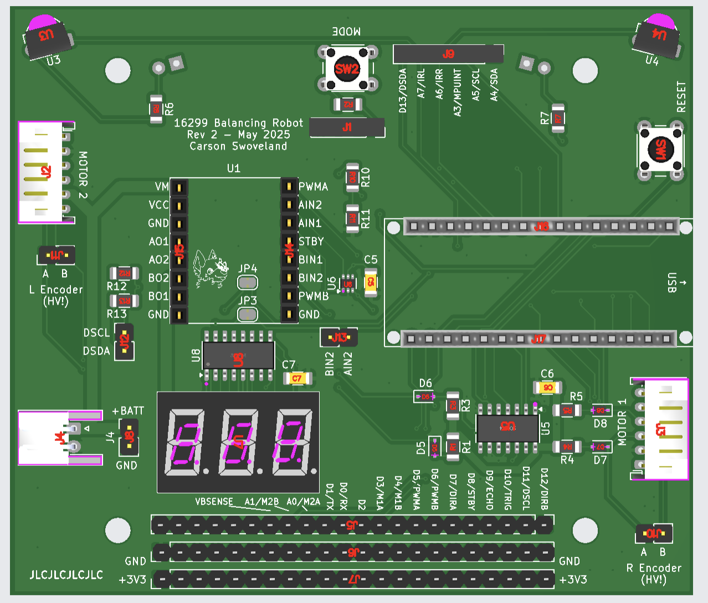

# 16299 Balancing Robot PCB

Updated version of the PCB for 16299.

A submodule is used for some parts, so be sure to clone recursively:
```bash
git clone --recursive https://github.com/SuperTails/16299-balancing-robot.git
```

## Ordering PCBs

### 1 - Generate Bill of Materials

To generate the BoM:

1. Open the schematic editor
2. Open the "edit symbol fields" menu (table icon along the top ribbon)
3. Ensure the settings are as shown below
4. Hit "export".


### 2 - Generate Gerber Files

To generate the gerber files:
1. Open the PCB editor
2. File > Fabrication Outputs > Gerbers (.gbr)...
3. Ensure the settings are as shown below, including...
4. ... Make sure you set your output folder to `fab/`.
5. Click "Plot"


More information for plotting Gerber and Drill files is available on
[JLC's guide](https://jlcpcb.com/help/article/how-to-generate-gerber-and-drill-files-in-kicad-7).

### 3 - Generate Drill Files

To generate the drill files:
1. From the Gerbers menu in the previous step, click "Generate Drill Files"
3. Ensure the settings are as shown below
5. Click "Generate"


More information for plotting Gerber and Drill files is available on
[JLC's guide](https://jlcpcb.com/help/article/how-to-generate-gerber-and-drill-files-in-kicad-7).

### 4 - Generate Placement Files

To generate the placement files:
1. Open the PCB editor
2. File > Fabrication Outputs > Component Placement (.pos, .gbr)...
3. Ensure the settings are as shown below
4. Click "Generate Position File"


### 5 - File Format Conversion

To convert the files into JLC's preferred format, run the `format_bom.py` script:

```bash
python3 format_bom.py
```

This will generate `fab/bom-jlc.csv` and `fab/balancingrobot-top-pos-jlc.csv`,
which should be used for JLC's PCB assembly options (discussed later).

### 6 - Upload Gerbers

Zip the `fab/` directory and upload it to [JLC's website](https://jlcpcb.com/).
Rarely, the file upload can take up to 10 minutes to complete.

### 7 - Select Ordering Options

Most settings should default correctly,
but there are a few changes:

1. Set the quantity to the desired amount
2. Ensure that the order mark is set to "Order Number (Specify Position)"
3. Enable "PCB Assembly"
4. Hit "next"


### 8 - Uploading BOM and Placing Components

When prompted to "Upload BOM" and "Add CPL file",
upload `fab/bom-jlc.csv` and `fab/balancingrobot-top-pos-jlc.csv`.

It may issue a warning that D9 and D10 are not present in the CPL,
this is normal and you can continue.
D9 and D10 are the IR LEDs which are mounted on the underside of the board,
and doing assembly for both top and bottom components makes shipping difficult.

All parts should be selected in the right column and there should be no other errors.

When moving on to placement, JLC may note that
"The system detects component that may be offset from the PCB,
does it try to automatically align it?"
Click **cancel** on this prompt, as it will displace many of the components to the wrong place.

The through-hole components typically need to be both rotated and dragged to fit;
the surface mount components should **only be rotated**.

Ensure that all surface mount components
**have the pink dot (pin 1) aligned with the corresponding silkscreen arrow**.
Some of the SMD components may be upside-down.

There will be four rows of header pins far above the rest of the PCB (shown below);
these are the sockets for the Arduino Nano and the motor driver.
Be sure to place them as well.


Once placement is finished, the board should appear as shown below:



When prompted to select a category for your order, I usually select "Robot",
as shown below:


This completes all the placement steps,
simply complete the rest of the checkout steps to order the PCB.

**After ordering, you may receive an email saying that the footprint of the 7-segment display is incorrect.**
**As long as the decimal point is on the bottom and the pink dot is in the bottom left, reply to the email and say the placement is correct.**
